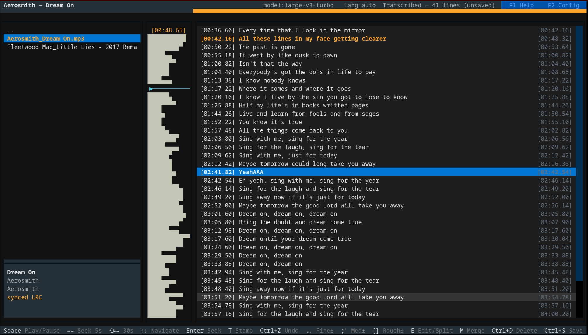

# lyrsmith

An AI-powered terminal UI for transcribing and editing time-synced song lyrics in [LRC format](https://en.wikipedia.org/wiki/LRC_(file_format)).

Point it at a directory, load a track, run Whisper to get a rough transcription, then nudge timestamps until they're right. Saves directly to the audio file's tags.

## Features

- **AI transcription** via [faster-whisper](https://github.com/SYSTRAN/faster-whisper) — runs locally, no cloud
- **Waveform display** for visual timing reference
- **LRC timestamp editing** — stamp, nudge (fine/medium/rough), merge, split, delete, undo
- **Plain text mode** for unsynced lyrics
- Reads and writes lyrics tags on **MP3, FLAC, OGG, OPUS**



## Requirements

- Python **3.13** (3.14 is not yet supported due to a ctranslate2 bug)
- **libmpv** (audio playback)
- **FFmpeg libraries** (waveform decoding via PyAV)

On Fedora/RHEL:
```
dnf install mpv-libs ffmpeg-free
```

On Debian/Ubuntu:
```
apt install libmpv-dev ffmpeg
```

On macOS, use the Homebrew installation method below — it handles all dependencies
automatically. GPU-accelerated transcription is not available on macOS; transcription
runs on CPU.

**NVIDIA GPU** — if you want GPU-accelerated transcription, also install libcublas and make sure it is registered with ldconfig:

```
# Fedora example — package name may vary
dnf install libcublas
echo "/usr/local/cuda-12.0/targets/x86_64-linux/lib" | sudo tee /etc/ld.so.conf.d/cuda.conf
sudo ldconfig
```

## Install

### macOS — Homebrew (experimental)

```
brew tap triluch/lyrsmith
brew install lyrsmith
```

All dependencies (mpv, ffmpeg, Python 3.13) are installed automatically.

### Linux / from source

Using [uv](https://docs.astral.sh/uv/):

```
git clone https://github.com/triluch/lyrsmith
cd lyrsmith
uv tool install . --python 3.13
```

Or with pipx:

```
pipx install .
```

## Updating

```
cd lyrsmith
git pull
uv tool install . --python 3.13 --reinstall
```

## Usage

```
lyrsmith [DIRECTORY]
```

If no directory is given, the last-used directory is restored (or the current working directory on first run).

Press **F1** inside the app to see all keybindings.

**Recommended model:** `large-v3-turbo` (the default) gives good results at reasonable speed. `large-v3` is noticeably more accurate for tricky lyrics but slower and needs more RAM. Configure via **F2**.

**Voice Activity Detection (VAD)** is disabled by default. If you're getting a lot of repeated lines or hallucinated text in the transcription, try enabling it with a low threshold like `0.00005`–`0.0001` — this pre-filters the audio before Whisper and can significantly improve results on tracks with instrumental sections or background noise.

---

And yeah, of course it is slopped out, what did you expect in current times?
